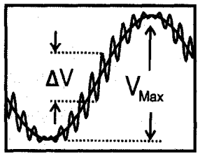

# chi-2-analyzer

Tools for **collecting and analyzing the second-order nonlinearity, χ⁽²⁾, of poled silica fiber (PSF)** from an electro-optic phase-modulation interferometer.

The repo is a set of reusable Python classes (instrument control, waveform simulation, peak-based analysis, curve fitting, plotting) plus scripts built on those classes that run the full experiment, from automated data acquisition to a χ⁽²⁾ number.

- [Background and motivation](#background-and-motivation)
- [How χ⁽²⁾ is measured](#how-χ²-is-measured)
- [Analysis methods](#analysis-methods)
- [Repository overview](#repository-overview)
- [Classes](#classes)
- [Scripts](#scripts)
- [Getting started](#getting-started)
- [Data file format](#data-file-format)
- [Notes and limitations](#notes-and-limitations)
- [License and acknowledgements](#license-and-acknowledgements)

---

## Background and motivation

Many areas of modern optics (frequency conversion, green lasers, entangled-photon generation) depend on **nonlinear optical effects**. These only occur in certain materials, and the efficiency of a second-order process scales as

$$\text{Eff} \propto \left(\chi^{(2)}\right)^2 L^2$$

where $L$ is the length of the nonlinear medium. The current best material is **periodically poled lithium niobate (PPLN)**, with $\chi^{(2)} \approx 30\ \text{pm/V}$. It is a bulk crystal, which brings real limitations:

- It cannot be integrated directly into fiber-optic systems. Coupling from fiber into free space, through the crystal, and back into fiber is lossy.
- It is expensive and tedious to manufacture, and crystals are length-limited to roughly 3 cm.

**Poled silica fiber (PSF)** is a promising alternative. Ordinary silica fiber has no $\chi^{(2)}$, but thermally poling a twin-hole fiber freezes a strong internal electric field into the glass. Combined with silica's intrinsic third-order nonlinearity, this creates an effective second-order nonlinearity:

$$\chi^{(2)} = 3\chi^{(3)} E_{\text{DC}}$$

PSF is already fiber-integrated, is not length-limited in principle (our samples are ~30 cm, already 10× longer than PPLN), and is cheap to produce. Its weakness is that $\chi^{(2)}$ has historically been too low. The best previously reported value was ~0.12 pm/V (De Lucia et al., *Opt. Lett.* 42, 2017), which would need several metres of fiber to match PPLN.

Optimizing a poling process is trial and error, so it needs a **fast, reliable and automated way to measure χ⁽²⁾ for every sample**. That is what this repo provides. Using these tools, our lab measured a record of **0.28 pm/V**, enough that roughly 3 m of PSF would match the efficiency of a PPLN crystal.

---

## How χ⁽²⁾ is measured

### Experimental setup

The measurement uses a fiber interferometer with the PSF in one arm.

1. **Piezo phase modulator (low frequency, large signal).** A piezo phase modulator, driven by a ramp from a waveform generator, sweeps the relative phase between the two arms. The detector sees a large, slow interference wave (period set by `periods_per_piezo_cycle` and the piezo frequency).
2. **Electro-optic probe (high frequency, small signal).** A higher-frequency AC voltage is applied across the poled fiber's electrodes. Through the electro-optic (Pockels) effect, the field $E$ changes the core index by $\Delta n$ in proportion to $\chi^{(2)}$, so the phase of the large wave is itself modulated. This appears as small ripples riding on the large wave.
3. **Detection.** An oscilloscope records the interferometer output. The ratio of the ripple amplitude to the large-wave amplitude gives the phase-modulation depth, and from it $\chi^{(2)}$.

<p align="center">
  
</p>

- $V_{\max}$: peak-to-peak amplitude of the large (piezo) wave.
- $\Delta V$: peak-to-peak amplitude of the small ripple at the steepest part of the large wave, where the detector is most sensitive to phase.

### Signal model

The detected signal is modeled as

$$V=A\left[1 + \cos(B(x-E) - C \cos(D(x-F)))\right] + G$$

| Parameter | Meaning | Code guess |
|---|---|---|
| $A$ | Half the large-wave amplitude, $V_{\max}/2$ | `(max - min) / 2` |
| $B$ | Angular frequency of the large wave, $2\pi \cdot N_{\text{periods}} f_{\text{piezo}}$ | `periods_per_piezo_cycle · 2π · piezo_frequency` |
| $C$ | **Phase-modulation depth** induced by the AC field (what we want) | from `estimated_chi2` |
| $D$ | AC probe angular frequency, $2\pi f_{\text{AC}}$ | `2π · ac_frequency` |
| $E, F$ | Time offsets of the large wave and the AC wave | position of the max, 0 |
| $G$ | DC offset | `min(voltage)` |

### From modulation depth to χ⁽²⁾

The AC field across the electrodes changes the core index by $\Delta n = \chi^{(2)} E / n_{\text{core}}$. Over a poled length $L$ this accumulates a phase swing of amplitude

$$C = \frac{\pi L}{\lambda}\frac{\chi^{(2)}}{n_{\text{core}}}\frac{V_{\text{AC}}}{f d_{\text{eff}}}$$

so

$$\chi^{(2)} = \dfrac{n_{core} \lambda d_{eff}}{\pi V_{ac} L} \sin\left(\dfrac{\Delta V}{V_{max}}\right)$$

| Symbol | Meaning |
|---|---|
| $\lambda$ | Wavelength of the light (e.g. 1550 nm) |
| $L$ | Length of fiber between the electrodes (poled length) |
| $n_{\text{core}}$ | Refractive index of the fiber core |
| $V_{\text{AC}}$ | Peak-to-peak AC probe voltage |
| $d_{\text{eff}}$ | Shortest distance between the two electrodes |
| $f$ | Field adjustment factor: simulated average field across the electrodes divided by the parallel-plate estimate $V/d_{\text{eff}}$ (`field_adjustment_factor`) |

### Getting $C$ from the ratio $\Delta V / V_{\max}$

Near the steepest point of the large wave the signal is $\tfrac{V_{\max}}{2}\left[1 + \sin(C\cos\omega t)\right]$, which swings between $\pm\sin C$. Its peak-to-peak size is therefore $V_{\max}\sin C$, giving

$$\frac{\Delta V}{V_{\max}} = \sin C \quad\Longrightarrow\quad C = \arcsin\left(\frac{\Delta V}{V_{\max}}\right)$$

For small modulation, $C \approx \Delta V / V_{\max}$. Substituting into the boxed equation above gives the formula used by the `Analyzer`:

$$\chi^{(2)} = \frac{n_{\text{core}}\lambda d_{\text{eff}}}{\pi L V_{\text{AC}}}\arcsin\left(\frac{\Delta V}{V_{\max}}\right)$$

(The `Analyzer` uses the parallel-plate approximation, i.e. $f = 1$. Multiply its result by $f$ to match the `CurveFitter` convention.)

---

## Analysis methods

The repo implements three independent ways to extract $C$ (and therefore $\chi^{(2)}$) from the same oscilloscope trace. Comparing them is a useful consistency check.

### 1. Peak-based analysis (no fitting)

The `Analyzer` smooths the trace, locates the maxima and minima of the large wave, finds the midpoints between them, and then searches the immediate neighbourhood of each midpoint for the local ripple maximum and minimum. It computes $\Delta V / V_{\max}$ for every half-period of the large wave and converts each to a $\chi^{(2)}$ value. Because it does not fit anything, it is fast and has no convergence failure modes. Discontinuities that coincide with optima or midpoints are filtered out.

### 2. Time-domain curve fitting

`CurveFitter.fit_waveform` fits the full signal model with `scipy.optimize.curve_fit` in **two stages**:

1. **Stage 1:** only $A$, $C$, $E$, $G$ are free (with tight bounds on $A$ and $G$). $B$, $D$, $F$ are fixed at their expected values.
2. **Stage 2:** all parameters are released, within bounds around the stage 1 result.

Pinning the frequencies first avoids the fit collapsing into one of the many local minima that a fast cosine-in-a-cosine produces.

### 3. Frequency-domain fitting (Bessel sidebands)

Phase modulation produces a spectrum much like an electro-optic frequency comb. By the Jacobi–Anger expansion,

$$\cos\!\big(\theta(t) - C\cos\omega t\big) = \operatorname{Re}\!\Big[e^{i\theta(t)} \sum_{n=-\infty}^{\infty} (-i)^n J_n(C)\, e^{i n \omega t}\Big]$$

so the sideband at the $n$-th harmonic of the AC frequency has a magnitude proportional to the Bessel function $|J_n(C)|$. `CurveFitter.fit_waveform_frequency`:

1. Removes the DC offset, applies a Hann window, and takes the DFT.
2. Extracts the peak magnitude near each of the first `max_harmonic` harmonics of $f_{\text{AC}}$, within `search_radius_hz`.
3. Fits $20\log_{10}|Y_n| = A_{\text{dB}} + 20\log_{10}|J_n(C)|$ against harmonic order $n$ to get $C$.

The `frequency_fit.py` script then fixes the remaining parameters ($A, B, D, E, F, G$) with a bounded **time-domain** fit, seeded with the frequency-domain $C$ and letting it vary within ±20%. Pulling $C$ out in the frequency domain sidesteps the phase-fitting problems of the pure time-domain approach and is expected to be more robust to experimental noise.

---

## Repository overview

```
chi-2-analyzer/
├── classes/
│   ├── analyzer.py        # peak-finding χ⁽²⁾ analysis (no fitting)
│   ├── curve_fitter.py    # time-domain and frequency-domain fitting
│   ├── display.py         # plotting for raw, analyzed and fitted data
│   ├── interface.py       # oscilloscope / waveform generator drivers (PyVISA)
│   └── simulator.py       # synthetic oscilloscope signals
│
├── acquire_frequency_dependence.py   # automated χ⁽²⁾-vs-frequency data capture
├── frequency_fit.py                  # χ⁽²⁾ from a waveform, frequency-domain fit
├── fit_curve.py                      # χ⁽²⁾ from a waveform, time-domain fit
└── ...                               # acquisition, plotting and utility scripts
```

---

## Classes

All classes live in `classes/` and are documented with docstrings. Run scripts from the repository root so that `from classes.<module> import ...` resolves.

### `Analyzer` (`classes/analyzer.py`)

Turns a recorded waveform into χ⁽²⁾ values **algorithmically, without curve fitting**. It finds and sifts local minima and maxima to measure the large-wave and ripple amplitudes, then applies $\chi^{(2)} \propto \arcsin(\Delta V / V_{\max})$. `analyze()` returns one χ⁽²⁾ value (in m/V) per half-period of the large wave. Several tunable parameters control smoothing, search windows, and rejection of discontinuities and implausible ratios (`voltage_ratio_acceptance`). A `debug=True` mode returns the detected optima so they can be overlaid on the data with `Display`.

### `CurveFitter` (`classes/curve_fitter.py`)

Fits the signal model with SciPy in two ways:

- `fit_waveform()`: two-step time-domain fit, as described above.
- `fit_waveform_frequency()`: DFT, then Bessel-sideband fit for $C$.

`get_chi2(C)` converts a fitted $C$ to χ⁽²⁾ (in m/V).

### `Display` (`classes/display.py`)

Matplotlib helpers for visualizing data, analyzed or not:

- `visualize_waveform()`: voltage vs. time, optionally annotated with detected (and ideal) maxima, minima, midpoints and ripple optima.
- `plot_fitted_curve()`: the model curve from a set of fitted parameters.
- `compare_fitted_curve()`: fit overlaid on the experimental data, labelled with the resulting χ⁽²⁾.

### `interface` (`classes/interface.py`)

Drivers for the lab equipment over GPIB (via PyVISA), used to build fully automated experiment scripts:

- `HP54600B`: oscilloscope. Connection check, screen configuration (`set_screen`), waveform acquisition (`acquire_signal`) and amplitude measurement (`get_amplitude`).
- `AWG` (abstract base), with `Agilent33250A` and `Agilent33120A` implementations: frequency, voltage, waveform shape (`WaveformShape`), ramp symmetry, output on/off and reset.

### `Simulator` (`classes/simulator.py`)

Generates synthetic oscilloscope traces, including the modulated interferometer signal with a chosen χ⁽²⁾ and optional additive white Gaussian noise at a specified SNR. It is the ground truth for checking the `Analyzer` and `CurveFitter`: simulate a known χ⁽²⁾, run the analysis, and see what comes back. It also provides the ideal marker positions for the large wave, for calibrating the analyzer's parameters.

---

## Scripts

### Key scripts

| Script | What it does |
|---|---|
| **`acquire_frequency_dependence.py`** | Fully automated acquisition of χ⁽²⁾ waveforms across a range of AC frequencies. For each frequency it configures both waveform generators and the oscilloscope, measures the actual AC voltage, then captures many shots and saves each to a text file with all experimental parameters in the header. |
| **`frequency_fit.py`** | Loads a saved waveform, fits it in the **frequency domain** (DFT → Bessel sidebands) to get $C$, refines the other parameters in the time domain, and plots the fit with the resulting χ⁽²⁾. |
| **`fit_curve.py`** | Loads a saved waveform and fits it purely in the **time domain** (two-step fit), then plots the fit with the resulting χ⁽²⁾. |

### Other scripts

| Script | Purpose |
|---|---|
| `acquire_waveform.py`, `acquire_waveform2.py` | Capture a single waveform from the oscilloscope and save it with its parameters |
| `calibrate_voltage_function.py` | Capture test waveforms over a range of AC voltage settings at chosen frequencies, to work out the `voltage_function` used in the automated acquisition |
| `get_amplitudes.py` | Mean peak-to-peak waveform amplitude vs. frequency from saved waveform files (saves a CSV and plots it) |
| `data_reader.py` | Median, standard deviation and histogram of a set of χ⁽²⁾ values |
| `chi2_frequency_response.py` | Fit a low-pass response to χ⁽²⁾ vs. frequency |
| `plot_curve_linear.py`, `plot_curve_loglog.py` | Plot χ⁽²⁾ vs. AC frequency on linear / log–log axes |
| `plot_waveform.py`, `plot_waveforms.py` | Plot a waveform file, or animate a sequence of files |
| `compare_plots.py` | Overlay normalized curves from different measurements |
| `fourier_test.py`, `test.py` | Spectrum and simulator experiments |

---

## Getting started

### Requirements

- Python 3.9+
- `numpy`, `scipy`, `matplotlib`, `pandas`
- `pyvisa` plus a VISA backend (e.g. NI-VISA) and a GPIB interface, **only if** you are controlling instruments. Analysis and simulation need no hardware.

```bash
git clone https://github.com/PerryXu1/chi-2-analyzer.git
cd chi-2-analyzer
pip install numpy scipy matplotlib pandas pyvisa
```

### Try it without any hardware

Simulate a trace with a known χ⁽²⁾ and recover it with the `Analyzer`:

```python
import numpy as np
from classes.simulator import Simulator
from classes.analyzer import Analyzer

# Simulate 50 ms of interferometer signal with chi2 = 0.15 pm/V
time = np.linspace(0, 0.05, 100_000)
voltage = Simulator(time).noisy_modulated_sine(
    Vpp=1, phase_mod_cycles=2.5, phase_mod_frequency=120,   # large wave
    ac_frequency=15_000, ac_voltage=240,                    # EO probe
    chi2=0.15e-12, core_index=1.45, eff_distance=41.1e-6,
    field_adjustment_factor=1.0, SNR=60,
)

analyzer = Analyzer(
    core_index=1.45, wavelength=1550e-9, eff_distance=41.1e-6,
    ac_voltage=240, length=0.3,
    driver_frequency=120, phase_mod_cycles=2.5,
)

chi2 = np.array(analyzer.analyze(time=time, voltage=voltage)) * 1e12  # m/V -> pm/V
print(f"chi2 = {np.median(chi2):.3f} ± {chi2.std():.3f} pm/V")
```

### Analyze real data

1. Put your waveform files somewhere accessible (see [Data file format](#data-file-format)).
2. Open `frequency_fit.py` or `fit_curve.py`, and edit the sections marked `CHANGE`: the file name, the fiber parameters (`poled_fiber_length`, `core_index`, `effective_distance`, `field_adjustment_factor`, ...), and the fit settings (initial χ⁽²⁾ guess, `min_C`, `max_harmonic`, ...).
3. Run it from the repo root:

```bash
python frequency_fit.py   # frequency-domain fit
python fit_curve.py       # time-domain fit
```

### Run the experiment

1. Wire up the interferometer. The piezo is driven by one waveform generator, the EO probe by another (through an amplifier if needed), and the detector goes to the oscilloscope.
2. Set the GPIB addresses of the instruments in `acquire_frequency_dependence.py` and edit the constants at the top (wavelength, poled length, electrode spacing, core index, number of shots, frequency list, voltage function).
3. Run `python acquire_frequency_dependence.py`. It steps through the frequencies and writes one file per shot.

---

## Data file format

Waveforms are saved as text files with two header lines. The first holds experimental parameters as comma-separated `KEY=value` pairs, which the analysis scripts parse automatically. The second holds column names, followed by `time,voltage` rows:

```
POLE=MAX, AC_VOLTAGE=..., AC_FREQUENCY=..., PIEZO_FREQUENCY=..., WAVELENGTH=..., ...
Time(s),Voltage(V)
0.000000e+00,1.234e-02
...
```

The fitting scripts read `AC_VOLTAGE`, `AC_FREQUENCY` and `PIEZO_FREQUENCY` from the header and load the data with `np.loadtxt(..., skiprows=2, delimiter=",")`.

---

## Notes and limitations

- **Units.** The classes work in SI units (χ⁽²⁾ in m/V). Scripts multiply by 10¹² to report pm/V.
- **Analyzer accuracy depends on the frequency ratio.** The ripple extrema it measures sit about half an AC period apart, during which the large wave itself keeps moving. On simulated data the analyzer therefore overestimates χ⁽²⁾ when the AC frequency is not much higher than the large-wave frequency. With $f_{\text{AC}}/f_{\text{large wave}}$ of 10, 20, 50 and 100, the simulated 0.15 pm/V came back as roughly 0.22, 0.17, 0.157 and 0.150 pm/V. Keep this ratio high (≳ 50), or use the curve-fitting methods, which model the large-wave motion explicitly.
- **Fit bounds.** The initial χ⁽²⁾ guess must give a $C$ at or above `min_C`, or `curve_fit` will complain that the initial guess is outside the bounds. Tune `estimated_chi2`, `min_C` and the tolerances to your data.
- **Parameters are lab-specific.** The default constants in the scripts (electrode spacing, field adjustment factor, core index, GPIB addresses) belong to one specific setup. Check every value before trusting a result.

---

## License and acknowledgements

Released under the [MIT License](LICENSE).

Developed at the University of Toronto, Department of Electrical and Computer Engineering, in Professor Li Qian's lab. Thanks to Andi Shahaj and Professor Li Qian.

**Reference:** F. De Lucia, D. W. Keefer, C. Corbari, and P. J. A. Sazio, "Thermal poling of silica optical fibers using liquid electrodes," *Opt. Lett.* 42(1), 69–72 (2017).
